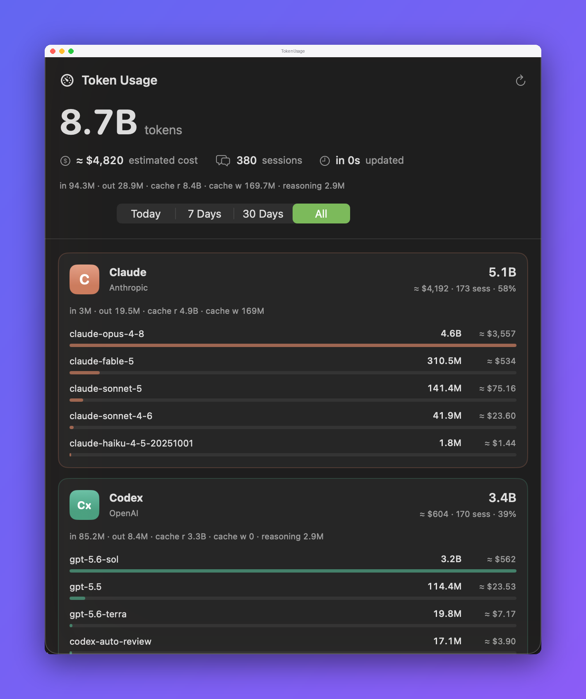

# TokenUsage

A menu-bar app that tracks token usage across your AI coding agents — Claude,
Codex, Kimi, MiniMax, and opencode — by reading their local logs. No network
calls, no API keys, nothing leaves your machine.

Antigravity is detected but reports no usage — its local logs store token counts
in a format the app can't read. See [Limitations](#limitations).



## Download

**[⬇︎ Download for macOS](https://github.com/Alyetama/TokenUsage/releases/latest/download/TokenUsage.dmg)**

`https://github.com/Alyetama/TokenUsage/releases/latest/download/TokenUsage.dmg`
always points at the newest release, because the DMG filename carries no
version — see [Releases](https://github.com/Alyetama/TokenUsage/releases) for
the changelog.

## Features

- Running token total in the menu bar, with a tap-to-expand breakdown per agent
- A resizable dashboard window listing every agent and model, sorted by usage
- Today / 7 Days / 30 Days / All time ranges
- Input, output, cache-read, and cache-write split per agent and for the
  running total; per-model rows show total tokens and cost
- Estimated cost per agent, with real cost pulled straight from the source
  where the agent records it (opencode and MiniMax)
- Updates within seconds of an agent writing to its logs (FSEvents-driven),
  with a relaxed fallback poll — no constant re-scanning
- Reads local files only: `~/.claude`, `~/.codex`, `~/.kimi-code`,
  `~/.minimax`, `~/.local/share/opencode`, and `~/.gemini` (detection only)

## First launch (opening an unsigned app)

**TokenUsage isn't signed with an Apple Developer ID**, so macOS blocks it the
first time you open it. This is expected — you only need to do one of the
following once, and it opens normally afterward.

**1. Right-click to open.** In Finder, **Control-click** (or right-click)
`TokenUsage`, choose **Open**, then click **Open** again in the dialog.

**2. If macOS still won't let you (newer versions):** open
**System Settings → Privacy & Security**, scroll down to the message about
`TokenUsage` being blocked, and click **Open Anyway**. Confirm with
**Open Anyway** (and Touch ID or your password if asked).

**3. Terminal fallback.** If neither works, remove the quarantine flag and open
it normally:

```bash
/usr/bin/xattr -dr com.apple.quarantine /Applications/TokenUsage.app
```

(Adjust the path if you keep the app somewhere other than `/Applications`.)

## Limitations

- **Antigravity reports no usage.** It is detected when installed, but its
  conversation databases (`~/.gemini/antigravity-cli/conversations/*.db`) store
  every payload as an opaque binary blob and expose no token, usage, or cost
  column, so the app shows an explanatory note instead of a number. Nothing is
  estimated for it.
- **Costs are estimates except for opencode and MiniMax**, which record a real
  cost that the app uses as-is. Everything else is priced from a small built-in
  table, so it drifts when vendors change prices, and is always shown with `≈`.
- **An agent is only counted if it writes usage to a local file.** Usage from a
  machine you don't run the agent on isn't visible here.

## Requirements

macOS 14 or later (`Package.swift` targets `.macOS(.v14)`). Building from source
needs a Swift 6 toolchain; the only system dependency is `libsqlite3`.

## Build from source

```bash
git clone https://github.com/Alyetama/TokenUsage.git
cd TokenUsage
./build.sh
```

## License

[MIT](LICENSE) © 2026 Alyetama
